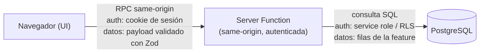

# Lenguaje visual de diagramas de arquitectura

Usa el mismo lenguaje visual todas las semanas para que los diagramas sean comparables entre sprints.

## Reglas de color

| Elemento                               | Color          | Significado                                                                                             |
| -------------------------------------- | -------------- | ------------------------------------------------------------------------------------------------------- |
| Navegador / UI                         | **Azul**       | Todo lo que vive en el navegador del usuario.                                                           |
| Server Functions y server routes       | **Verde**      | Código que corre en el servidor, dentro de tu frontera de confianza.                                    |
| Proveedores externos                   | **Morado**     | Servicios de terceros (Supabase Auth, Telegram, Mercado Pago, OAuth providers).                         |
| Trabajo asíncrono / background         | **Amarillo**   | Jobs, workers, colas y tareas de larga duración.                                                        |
| Frontera de confianza (trust boundary) | **Borde rojo** | Límite entre lo que controlas y lo que no; todo cruce de esta línea debe validar entradas y autenticar. |

## Reglas de flechas

- **Flecha punteada**: webhooks o eventos asíncronos.
- **Flecha sólida**: requests síncronos.
- **Toda flecha anota tres cosas**: el tipo de request, el contexto de autenticación y los datos importantes que viajan.

## Herramienta

- Usa **Excalidraw** o **draw.io**.
- Guarda el archivo fuente del diagrama junto al design doc de la semana.
- Actualiza el diagrama final al cerrar el sprint (Bloque 3).

## Ejemplo de respaldo en Mermaid

Cuando no puedas usar Excalidraw o draw.io, este ejemplo muestra el estilo esperado:

Notas del ejemplo:

- El navegador (azul) llama a una Server Function (verde) con autenticación same-origin.
- La Server Function consulta PostgreSQL (verde, dentro de la frontera de confianza).
- En Excalidraw o draw.io, dibuja un **borde rojo** alrededor del bloque servidor+BD: ahí vive la frontera de confianza.
