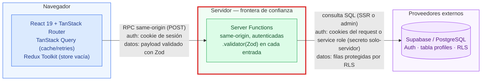
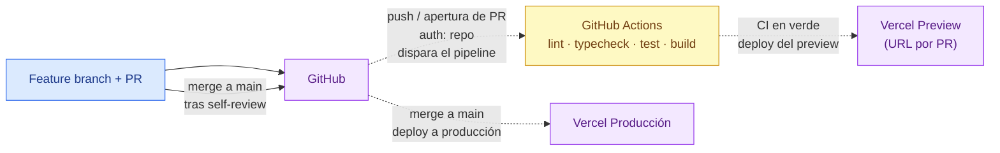

# Semana 0 — Foundation Setup (base full-stack reutilizable)

## Problema

Cada semana del roadmap de 10 semanas entrega una feature nueva sobre la misma base. Sin una Semana 0 que fije defaults fuertes, cada sprint volvería a gastar tiempo en boilerplate: qué gestor de paquetes, cómo validar variables de entorno, dónde vive cada tipo de estado, cómo se protege el código de servidor, cómo se aplican migraciones y cómo se despliega. El problema que resuelve esta semana no es de usuario final: es que **ninguna feature futura tenga que redecidir decisiones de tooling**. El criterio de "done" del roadmap lo dice directo: una feature nueva se puede crear sin tocar la base.

## Alcance

**Incluido:**

- Proyecto TanStack Start v1 + Vite 8 + React 19 con TypeScript estricto (tsc 7 nativo).
- Validación de variables de entorno tipada y fail-fast con Zod 4 (variables públicas `VITE_*` y variables solo-servidor separadas).
- Cliente TanStack Query 5 con defaults globales: `staleTime` 30 s, `retry` máximo 2 y nunca en errores 4xx, mutaciones sin retry.
- Store de Redux Toolkit configurada pero **vacía a propósito**, con hooks tipados listos para el primer slice que realmente lo necesite.
- Clientes Supabase SSR: servidor (con cookies del request), admin (service role, solo-servidor) y navegador.
- Flujo de trabajo de migraciones de base de datos (Supabase CLI) con la tabla `profiles` inicial: RLS habilitada, políticas own-row y trigger `handle_new_user`.
- ESLint 10 + Prettier + lefthook (pre-commit: lint + format; pre-push: typecheck), incluida la regla `no-restricted-imports` que protege `src/server/**`.
- CI de GitHub Actions: lint, typecheck, test y build en cada push/PR.
- Ruta de despliegue en Vercel con preview por PR (Nitro ya configurado en `vite.config.ts`).
- Documentación y plantillas: `docs/conventions.md`, `docs/migrations.md`, plantillas de design doc, ADR y diagrama, y plantilla de PR.
- Feature de ejemplo (`src/features/example-feature/`) que demuestra todas las convenciones: `schemas.ts` (Zod como única fuente de verdad), `service.ts` (lógica pura), `functions.ts` (Server Functions con `.validator`), `queries/`, `mutations/` y `components/`.

**Excluido explícitamente:**

- Autenticación real (login, sesiones, OAuth): Semana 1+.
- Features de negocio del roadmap (webhooks, pagos, AI, tiempo real): Semanas 2+.
- Tailwind o cualquier sistema de estilos: se decide en su semana.
- Slices de Redux: la store queda vacía hasta que exista estado local de UI complejo que lo justifique.

## Arquitectura

Diagrama en el lenguaje visual del repositorio (azul = navegador, verde = servidor propio, morado = externos, borde rojo = frontera de confianza, flechas con tipo de request + contexto de auth):

- El **borde rojo** marca la frontera de confianza: el navegador nunca habla directo con la base de datos ni ve secretos; todo cruce pasa por una Server Function que valida con Zod y verifica la sesión.
- Supabase (morado) es un proveedor externo: el servidor lo consume con las cookies del request (cliente SSR) o con la service role key (cliente admin, jamás expuesta al bundle).

Flujo de despliegue:

- El CI (amarillo) es trabajo asíncrono disparado por eventos: flechas punteadas.
- Cada PR genera un preview aislado; producción solo recibe merges a `main` con CI en verde.

## Modelo de datos

Una sola tabla en la migración inicial:

**`profiles`**

| Columna        | Tipo        | Restricciones                                        |
| -------------- | ----------- | ---------------------------------------------------- |
| `id`           | uuid        | PK, referencia a `auth.users.id` `ON DELETE CASCADE` |
| `email`        | text        | no nulo                                              |
| `display_name` | text        |                                                      |
| `created_at`   | timestamptz | no nulo, default `now()`                             |
| `updated_at`   | timestamptz | no nulo, default `now()`                             |

- **RLS habilitada**: la tabla no es accesible sin política.
- **3 políticas own-row** (`select`, `insert`, `update`): cada usuario solo puede leer, crear y modificar su propia fila (`auth.uid() = id`).
- **Trigger `handle_new_user`**: crea la fila de `profiles` automáticamente al registrarse un usuario en Supabase Auth. Es `SECURITY DEFINER` con `search_path` vacío (evita secuestro de esquema y el warning de Supabase).
- La relación con `auth.users` es 1:1 con borrado en cascada: sin usuario no hay perfil huérfano.

El workflow de migraciones (crear, aplicar local, promover) está documentado en `docs/migrations.md`.

## Seguridad

- **Validación Zod en todos los boundaries**: cada Server Function valida su entrada con `.validator()`; nada entra al servidor sin pasar por el esquema de la feature (`schemas.ts` como única fuente de verdad).
- **Regla ESLint de frontera servidor**: `no-restricted-imports` impide importar `src/server/**` desde cualquier archivo del cliente; solo los `functions.ts` de cada feature pueden hacerlo. El error aparece en el editor antes de llegar a producción.
- **Secretos solo en el servidor**: `SUPABASE_SERVICE_ROLE_KEY` vive exclusivamente en el servidor. Jamás lleva prefijo `VITE_` (ese prefijo lo embebe Vite en el bundle cliente). Solo las variables públicas (`VITE_SUPABASE_URL`, `VITE_SUPABASE_ANON_KEY`) salen al navegador.
- **Fail-fast de entorno**: `src/lib/env.ts` y `src/server/env.ts` validan con Zod al arrancar; si falta una variable, la app no arranca y el error dice exactamente cuál falta.
- **RLS por defecto**: toda tabla nueva nace con RLS habilitada y políticas explícitas; no existe el caso "tabla pública por descuido".
- El acceso del servidor a la base de datos usa cookies del request (respeta RLS) y el cliente admin con service role queda reservado a operaciones de sistema (p. ej. triggers y tareas internas).

## Propiedad del estado

Resumen de la tabla de convenciones (detalle en `docs/conventions.md`): si el dato viene del servidor o vuelve al servidor, es de **TanStack Query**; si solo existe en la pantalla, es de **Redux Toolkit** o del componente; lo durable de negocio vive en **PostgreSQL**; lo compartible, en la **URL**; los secretos, **solo-servidor**.

Marcado para la base y la feature de ejemplo:

- [x] **TanStack Query** — el saludo de `example-feature` llega por una Server Function vía `queries/use-greeting.ts`; la mutación `use-shout-greeting.ts` gestiona su estado de pending. Demuestra cache, retries y estado de error.
- [ ] **Redux Toolkit** — store configurada y **vacía a propósito**: en la Semana 0 no hay estado local de UI complejo. Cuando exista (modales, layout, command palette), se añade el slice con los hooks tipados ya listos.
- [x] **Estado de componente** — el campo del formulario de la feature de ejemplo vive en el componente hasta el submit.
- [ ] **Parámetros de URL** — sin filtros compartibles todavía; se aplicará a partir de la primera feature con búsqueda.
- [x] **Base de datos** — la tabla `profiles` es el estado durable del usuario (email, `display_name`).
- [ ] **Solo servidor** — sin OAuth ni pagos todavía; la `SUPABASE_SERVICE_ROLE_KEY` ya cumple esta regla (nunca en el cliente).

## Modos de falla

- **Variable de entorno faltante o inválida** → la app no arranca y el error nombra la variable exacta (fail-fast de Zod). Mejor un crash en arranque que un `undefined` en producción. Recuperación: completar `.env` y relanzar.
- **Server Function que falla** → TanStack Query reintenta **máximo 2 veces y nunca ante errores 4xx** (no tiene sentido reintentar un 400/401/404); el usuario ve el estado de error con un botón **reintentar** en la UI. Las mutaciones no reintentan (evita duplicar escrituras).
- **Migración defectuosa** → local: `pnpm db:reset` reconstruye la BD aplicando las migraciones en orden. Regla dura: **una migración ya aplicada jamás se edita**; se corrige con una migración nueva que la superseda (o revert en remoto si nothing dependía de ella). Detalle en `docs/migrations.md`.
- **CI en rojo** → el PR no se mergea; el preview de Vercel no bloquea por sí solo, pero el flujo exige CI verde antes del merge.
- **Deploy roto** → producción solo recibe `main`; revertir el merge restaura el deploy anterior.

## Trade-offs

- **pnpm vs npm**: pnpm 11 por installs más rápidos, disco compartido y `pnpm-lock.yaml` determinista; `packageManager` fijado en `package.json` para que `corepack` garantice la misma versión en CI y en cada máquina. Coste: una dependencia más de proceso; aceptado.
- **TypeScript 7 nativo + alias TS6 para tooling**: `@typescript/native` (npm:typescript@7) es el `tsc` del proyecto —mucho más rápido, sin JS API— pero typescript-eslint aún no lo soporta (issue typescript-eslint#10940). Decisión: alias side-by-side, `typescript` → `npm:@typescript/typescript6` para la tooling que necesita JS API. Coste: dos "TypeScripts" en `package.json`; se revisa cuando typescript-eslint soporte TS7. Ver [ADR-0003](decisions/0003-typescript-7-nativo-con-alias-ts6.md).
- **RTK vacía vs slices prematuros**: incluir la store sin slices demuestra la convención (RTK solo para UI compleja) sin pagar complejidad especulativa. Alternativa rechazada: crear slices "de ejemplo" que luego nadie borra.
- **Nitro en `vite.config.ts` vs target Node puro**: Nitro añade una capa al build, pero da deploy a Vercel **zero-config con preview por PR**, que es un entregable de la Semana 0. El target Node puro sería más simple de razonar, pero obligaría a mantener la config de deploy a mano.
- **Sin Tailwind en Semana 0**: los estilos no son bloqueantes para las features del roadmap y decidirlos con calma (o añadirlos en su semana) evita arrastrar un sistema visual improvisado. CSS plano por ahora.
- **Server Functions vs API REST propia**: las Server Functions dan RPC tipado end-to-end sin mantener una capa de endpoints; coste aceptado: los endpoints públicos (webhooks, OAuth) requerirán server routes explícitas desde la Semana 2.

## Respuestas de entrevista

1. **¿Por qué TanStack Query y no Redux para datos de servidor?** Porque los datos de servidor tienen problemas que Redux no resuelve por sí solo: cache, revalidación, stale-while-revalidate, retries, deduplicación y estado de mutaciones. Duplicarlos a mano en slices es código boilerplate propenso a desincronizarse. Redux queda para lo que sí le pertenece: estado local de UI complejo y sincrónico que no vive en el servidor.

2. **¿Por qué fallar rápido con las env vars?** Un entorno inválido detectado al arrancar falla en el primer segundo, con un mensaje que nombra la variable; el mismo problema detectado en runtime falla a mitad de una request del usuario, con un `undefined` difícil de trazar. Fail-fast convierte un bug difuso en un error de configuración obvio.

3. **¿Por qué una migración aplicada nunca se edita?** Porque las migraciones son un historial inmutable: otros entornos (CI, preview, producción) ya la aplicaron, y editarla hace que su checksum y su orden dejen de cuadrar —los entornos divergen silenciosamente—. La corrección segura es una migración nueva que superseda a la anterior; así todos los entornos convergen al mismo estado.

4. **¿Por qué webhooks van en server routes públicas y no en Server Functions?** Porque las Server Functions asumen un caller same-origin autenticado con cookie de sesión; un webhook llega de un tercero (Telegram, Mercado Pago) que se autentica con firma/token propio y una URL pública verificable. Mezclar ambos modelos rompería el presupuesto de seguridad de cada uno: cada tipo de request necesita su canal con su autenticación.

5. **¿Qué protege la regla ESLint de frontera servidor?** Impide que código cliente importe `src/server/**` —donde viven secretos y clientes con privilegios—, forzando que el único puente sean las Server Functions (`functions.ts`), que validan con Zod en el boundary. Convierte una fuga potencial de secretos al bundle en un error de lint inmediato en el editor.
